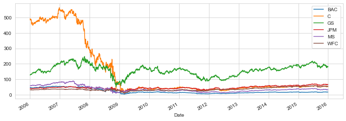
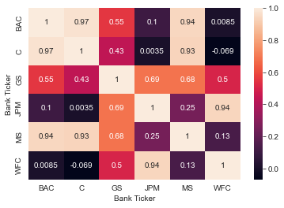

# Financial Crisis Analysis

## The data
Remote Data Access from [pandas-dataReader](https://pandas-datareader.readthedocs.io/en/latest/remote_data.html)

Data from Jan 1st 2006 to Jan 1st 2016 for the following banks:
- Bank of America
- CitiGroup
- Goldman Sachs
- JPMorgan Chase
- Morgan Stanley
- Wells Fargo

## Closing price leading to crash

## Correlation between the stocks Close Price

## Libraries

| Name | Library |
| ------ | ------ |
| Pandas | https://pandas.pydata.org/ |
| Matplotlib | https://matplotlib.org/ |
| Seaborn | https://seaborn.pydata.org/ |